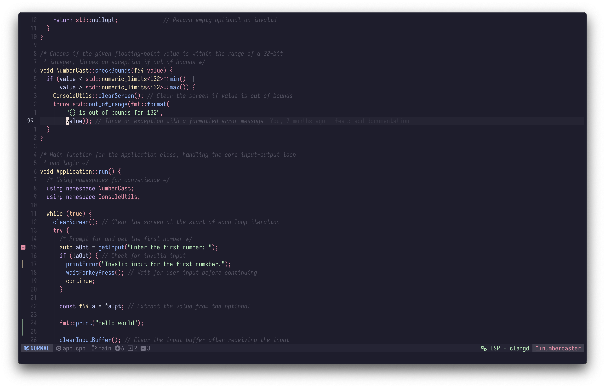
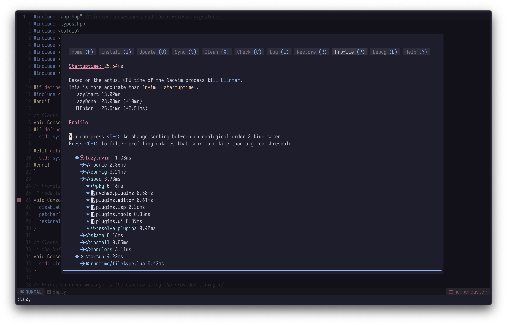

<h1 align="center">
    config.nvim 🚀
</h1>

<p align="center">
    <a href="https://github.com/neovim/neovim/releases/tag/v0.11.0">
    
    </a>
    <a href="https://github.com/Libsod/config.nvim/issues">
    
    </a>
    
</p>

This is my personal configuration for Neovim, built upon the [NvChad v2.5](https://nvchad.com/) Neovim distro. It aims for a comfortable, performant, and productive development experience across various languages, with a focus on speed, usability, and extensibility.




## ✨ Features

This configuration is designed to be:

*   🚀 **Fast & Performant**: Achieves startup times often under **30ms** (tested on `MacBook Pro 14 M1 Pro`; actual speed depends on your SSD/CPU). Powered by `lazy.nvim` for efficient plugin management and optimized settings.
*   🔧 **Simple & Ready-to-Use**: Aims to work "out of the box" once prerequisites are met and plugins are installed.
*   💻 **Modern & Lua-Powered**: A pure Lua configuration, leveraging the latest Neovim advancements.
*   🧩 **Modular & Customizable**: Thoughtfully structured into modules (`editor`, `lsp`, `tools`, `ui`) making it easy to understand, tweak, and extend.
*   📚 **Well-Documented**: Every plugin specification file (`plugins/*.lua`) and most configuration files (`configs/**/*.lua`) are thoroughly documented to explain their purpose and settings. *My goal is to maintain near 100% documentation coverage for custom configurations.*
*   💪 **Powerful & Full-Featured**: Provides comprehensive functionality for a productive coding workflow, including:
    *   🧠 **Intelligent LSP**: Robust Language Server Protocol integration (`nvim-lspconfig`) for autocompletion, diagnostics, code navigation, and signature help across numerous languages.
    *   🎨 **Sleek UI**: A visually appealing and customizable user interface built with NvChad's `base46` theming system and enhanced by plugins like `indent-blankline`, `gitsigns`, and `trouble.nvim`.
    *   🧰 **Comprehensive Toolset**:
        *   Efficient file navigation with `oil.nvim`.
        *   Powerful fuzzy finding with `telescope.nvim`.
        *   Seamless Git integration via `Neogit` and `gitsigns.nvim`.
        *   Integrated TODO management with `todo-comments.nvim` and `trouble.nvim`.
    *   ⌨️ **Intuitive Keybindings**: Sensible default and custom keymappings, easily discoverable with `which-key.nvim`.
    *   🦀 **Excellent Rust Development Support**: Dedicated support via `rustaceanvim` and `crates.nvim`.
    *   💻 **Enhanced Terminal**: Integrated terminal capabilities (via NvChad's included terminal and `toggleterm.nvim` as a dependency).
    *   📝 **Obsidian Integration**: Built-in support for managing your Obsidian notes.
    *   🧪 **Integrated Testing**: A streamlined testing experience with `neotest` and various language adapters.
    *   ✨ **Code Quality**: Automatic code formatting (`conform.nvim`) and linting (`nvim-lint`) on save.

## 📂 Configuration Structure

Here's a high-level overview of the configuration's directory structure and key files:

```
.
├──  init.lua <- Entry point, bootstraps lazy.nvim & loads core modules
├──  lua/
│     ├──  chadrc.lua <- NvChad specific overrides (theme, UI, etc.)
│     ├──  core/
│     │     ├──  autocmds.lua <- Custom autocommands
│     │     ├──  lsp.lua <- Core LSP helper functions (on_attach, diagnostics, etc.)
│     │     ├──  mappings.lua <- Global custom keymappings
│     │     └──  options.lua <- Global Neovim options (vim.o, vim.g)
│     ├──  configs/
│     │     ├──  lazy.lua <- Configuration for lazy.nvim plugin manager
│     │     ├──  editor/ <- Plugin configurations related to editing
│     │     │     └──  *.lua
│     │     ├──  lsp/
│     │     │     ├──  lspconfig.lua <- Main LSP server setup
│     │     │     ├──  plugins/ <- Configurations for LSP-enhancing plugins
│     │     │     │     └──  *.lua
│     │     │     └──  servers/ <- Specific configurations for individual LSP servers
│     │     │           ├──  init.lua <- Dynamically loads all server configs in this dir
│     │     │           └──  *.lua
│     │     ├──  tools/ <- Plugin configurations for developer tools
│     │     │     └──  *.lua
│     │     └──  ui/ <- Plugin configurations for UI enhancements
│     │           └──  *.lua
│     └──  plugins/
│           ├──  editor.lua <- Plugin specifications for 'editor' category
│           ├──  lsp.lua <- Plugin specifications for 'LSP' category
│           ├──  tools.lua <- Plugin specifications for 'tools' category
│           └──  ui.lua <- Plugin specifications for 'UI' category
├──  lazy-lock.json <- Lockfile for plugin versions managed by lazy.nvim
└──  README.md <- This file
```

*   **`init.lua`**: The main entry point that sets up `lazy.nvim` and loads the initial NvChad plugin and your custom plugin categories.
*   **`lua/chadrc.lua`**: Your primary file for NvChad specific customizations, like theme settings, UI component adjustments, and often a place for quick personal tweaks.
*   **`lua/core/*.lua`**: Contains fundamental custom settings:
    *   `autocmds.lua`: Your custom autocommands.
    *   `lsp.lua`: Core helper functions for LSP setup (like the shared `on_attach`).
    *   `mappings.lua`: Your global custom keybindings.
    *   `options.lua`: Global Neovim options (`vim.o`, `vim.g`).
*   **`lua/configs/lazy.lua`**: Configuration for the `lazy.nvim` plugin manager itself.
*   **`lua/configs/<category>/*.lua`**: Contains detailed configuration tables for specific plugins, organized by category.
*   **`lua/configs/lsp/servers/init.lua`**: Dynamically loads all individual LSP server configurations from its directory.
*   **`lua/plugins/*.lua`**: These files define which plugins are loaded by `lazy.nvim` for each category, along with their lazy-loading rules, dependencies, and how their configurations (from `lua/configs/`) are applied.

##  Prerequisites

*   **Neovim**: v0.11.0+ (latest stable version highly recommended).
*   **Git**: Essential for `lazy.nvim` to install plugins.
*   **Nerd Font**: Crucial for proper icon display in the UI (e.g., Iosevka Nerd Font, FiraCode Nerd Font, JetBrainsMono Nerd Font).
*   **Build Tools**:
    *   A **C/C++ Compiler** (like GCC or Clang) and **CMake**: Required by `telescope-fzf-native.nvim` for its build process, and potentially for some LSP servers or tools managed by Mason.
    *   **make**: Required for building `LuaSnip` dependencies.
*   **Command-line Utilities (Recommended for full functionality)**:
    *   `ripgrep` (rg): Powers Telescope's live_grep and other fast search features.
    *   `fd` (fd-find): Used by some Telescope pickers for finding files.
    *   `lazygit`: Recommended if you plan to use `Neogit` extensively or have custom keybindings relying on it.
    *   Specific **formatters** and **linters** for your languages if you wish `conform.nvim` and `nvim-lint` to use them beyond what LSP provides (e.g., `stylua`, `prettier`, `ruff`, `gofumpt`, `shellcheck`). Mason can install many of these.

## 💾 Installation

1.  **Back up your current Neovim configuration and data** (if any):
    ```bash
    mv ~/.config/nvim ~/.config/nvim.bak
    mv ~/.local/share/nvim ~/.local/share/nvim.bak
    mv ~/.local/state/nvim ~/.local/state/nvim.bak # For Neovim 0.10+ (or 0.9+ with persistent undo/shada)
    mv ~/.cache/nvim ~/.cache/nvim.bak
    ```
2.  **Clone this repository** into your Neovim configuration directory:
    ```bash
    git clone https://github.com/Libsod/config.nvim ~/.config/nvim
    ```

3.  **Start Neovim**:
    ```bash
    nvim
    ```
    *   On the first launch, `lazy.nvim` will automatically bootstrap itself and then install all specified plugins, including NvChad. This process might take a few moments.
    *   NvChad's setup (often including a command like `:MasonInstallAll` or an equivalent auto-setup mechanism) should then trigger. This will use `mason.nvim` to install all pre-configured LSP servers, linters, and formatters.
    *   Monitor the messages in the Neovim command line. If any tools are reported as missing or if you need to manage them later, you can use the `:Mason` command.

## 🧩 Key Plugins

This configuration is modular, with plugins organized into logical categories as defined in the `lua/plugins/` directory:

### 🖋️ Editor (`plugins/editor.lua`)

Plugins that directly enhance the text editing process:

*   **`hrsh7th/nvim-cmp`**: Autocompletion engine.
    *   `L3MON4D3/LuaSnip`: Snippet support.
*   **`nvim-treesitter/nvim-treesitter`**: Advanced syntax highlighting and code structure analysis.
*   **`windwp/nvim-ts-autotag`**: Automatic management of HTML/XML/JSX tags.
*   **`Wansmer/treesj`**: Splitting and joining code blocks.
*   **`numToStr/Comment.nvim`**: Easy code commenting.
*   **`kylechui/nvim-surround`**: Managing surrounding character pairs (brackets, quotes).
*   **`smoka7/hop.nvim`**: Quick text jumps using "hints".
*   **`chrisgrieser/nvim-spider`**: Enhanced word-motions.
*   **`gbprod/substitute.nvim`**: Improved search and replace operators.

### 🧠 LSP (`plugins/lsp.lua`)

Everything related to the Language Server Protocol:

*   **`neovim/nvim-lspconfig`**: Core LSP client configurator.
*   **`folke/neodev.nvim` & `folke/neoconf.nvim`**: Enhancements for Lua development in Neovim.
*   **Language-specific Extensions**:
    *   `mrcjkb/rustaceanvim`: For Rust.
    *   `pmizio/typescript-tools.nvim`: For TypeScript/JavaScript.
    *   `p00f/clangd_extensions.nvim`: For C/C++.
*   **LSP Utilities**:
    *   `ray-x/lsp_signature.nvim`: Displays function signatures.
*   **Build System & Dependency Management LSP Integrations**:
    *   `Civitasv/cmake-tools.nvim`: For CMake.
    *   `saecki/crates.nvim`: For Rust dependency management.

### 🛠️ Tools (`plugins/tools.lua`)

Auxiliary tools for development:

*   **File Management**:
    *   `stevearc/oil.nvim`: File manager.
*   **Search & Navigation**:
    *   `nvim-telescope/telescope.nvim`: Powerful fuzzy-finder.
        *   `telescope-fzf-native.nvim`: FZF native sorter for Telescope.
        *   `telescope-ui-select.nvim`: Uses Telescope for `vim.ui.select`.
*   **Code Quality**:
    *   `stevearc/conform.nvim`: Code formatting.
    *   `mfussenegger/nvim-lint`: Code linting.
*   **Testing**:
    *   `nvim-neotest/neotest` (with `neotest-zig`, `neotest-python` adapters): Test runner framework.
*   **Version Control**:
    *   `NeogitOrg/neogit`: Git interface (Magit-style).
*   **Specialized Tools**:
    *   `nvim-pack/nvim-spectre`: Project-wide search and replace with UI.
    *   `epwalsh/obsidian.nvim`: Obsidian integration.

### 🎨 UI (`plugins/ui.lua`)

Plugins for enhancing the user interface:

*   **Visual Editor Enhancements**:
    *   `lukas-reineke/indent-blankline.nvim`: Indentation guides.
    *   `lewis6991/gitsigns.nvim`: Displays Git changes in the sign column.
    *   `folke/paint.nvim`: Custom highlighting based on Tree-sitter or Lua patterns.
*   **Informational UI Elements**:
    *   `folke/which-key.nvim`: Displays available keybindings.
    *   `folke/todo-comments.nvim`: Highlights and navigates TODO, FIXME, etc.
    *   `folke/trouble.nvim`: Displays diagnostics, TODOs, LSP references in a dedicated window.
    *   `dnlhc/glance.nvim`: UI for LSP navigation (definitions, references).

## ⌨️ Key Keybindings

My `<leader>` key is set to **Space**.

Thanks to `folke/which-key.nvim`, after pressing `<leader>` (or other prefix keys like `g`, `<c-w>`), a popup will appear listing available commands.

Some of my frequently used custom mappings (see `lua/core/mappings.lua` and plugin configurations or run `:WhichKey` for a full list):

*   `<leader>ff`: Find files (`Telescope find_files`)
*   `<leader>fg`: Find in files (live grep) (`Telescope grep_string`)
*   `<leader>fb`: Find buffers (`Telescope buffers`)
*   `<leader>o`: Open file manager `oil.nvim` (this mapping is in `lua/core/mappings.lua`, the one in `obsidian.lua` config is for its internal mapping table)
*   `<leader>fm`: Format current file (`conform.nvim`)
*   `<leader>q`: Open/close diagnostics list (`trouble.nvim`)
*   `<leader>gn`: Open `Neogit`
*   `<leader>S`: Open `Spectre` (project-wide search and replace)
*   `;`: Quick command-line mode access (`:`)

## 💡 LSP Support (Language Servers)

This configuration leverages `nvim-lspconfig` and `mason.nvim` (via NvChad's integrated setup) to automatically install and manage Language Servers. The following servers are pre-configured and should be installed automatically via NvChad's `:MasonInstallAll` command (or on first launch):

*   `bashls` (Bash)
*   `clangd` (C/C++)
*   `asm_lsp` (Assembly)
*   `zls` (Zig)
*   `ols` (Odin)
*   `html`, `cssls` (Web)
*   `tailwindcss`
*   `eslint` (JavaScript/TypeScript linting)
*   `astro`
*   `basedpyright`, `ruff` (Python)
*   `omnisharp` (C#)
*   `gopls` (Go)
*   `lua_ls` (Lua)
*   `marksman` (Markdown)
*   `textlsp` (Generic text LSP)
*   `texlab` (LaTeX)
*   `jsonls`, `yamlls`, `taplo` (TOML), `lemminx` (XML)
*   `docker_compose_language_service`, `dockerls`
*   `sqls`
*   `autotools_ls`
*   `neocmake` (CMake)
*   `jdtls` (Java)
*   `glsl_analyzer` (GLSL)

If any LSP server, linter, or formatter is not installed automatically, or if you wish to manage them manually, you can use the `:Mason` command.

## 🛠️ Customization

The configuration is structured for easy customization, primarily within the `lua/` directory. Refer to the **Configuration Structure** section above for a map of key files.

*   **Plugins**: Add or modify plugin specifications in the respective files within `lua/plugins/`.
*   **Plugin Configurations**: Adjust detailed settings for each plugin in its corresponding file under `lua/configs/`.
*   **Core Settings**: Modify global Neovim options, custom mappings, and autocommands in the files within `lua/core/`.
*   **NvChad Specifics**: For NvChad's UI elements (theme, statusline modules not covered by your custom `lsp_clients`), refer to or create `lua/custom/chadrc.lua`. Your `init.lua` handles the main NvChad plugin loading.

After making changes to plugin specifications or their configurations, run `:Lazy sync` in Neovim to apply them.

---

## 🙏 Credits & Acknowledgements

This Neovim configuration, while personalized to my workflow, stands on the shoulders of giants. It is built upon the solid foundation and principles of **NvChad v2.5**.

*   🌟 **NvChad**: Huge thanks to the NvChad maintainers and its vibrant community for creating and evolving such a well-structured and performant Neovim distro. Their dedication to providing a fast, beautiful, and extensible base has been invaluable. ([NvChad GitHub](https://github.com/NvChad/NvChad), [NvChad Website](https://nvchad.com/))

*   💡 **Plugin Authors**: This setup wouldn't be possible without the incredible work of the many plugin authors whose tools are integrated here. Each plugin represents countless hours of development and a commitment to improving the Neovim experience for everyone. Please consider supporting them if you find their work useful!

*   🤝 **Community & Inspiration**: Thanks also to the broader Neovim community for continuous inspiration, shared configurations, and helpful discussions that shape how we use and customize this powerful editor.

## 🤝 Contributing

If you find a bug or have a suggestion for improvement, please feel free to create an Issue or Pull Request on this repository!

## 📄 License

This configuration is distributed under the terms of the [GNU General Public License v3.0](./LICENSE).
A copy of the license should be included in this repository. If not, see <https://www.gnu.org/licenses/gpl-3.0.html>.

